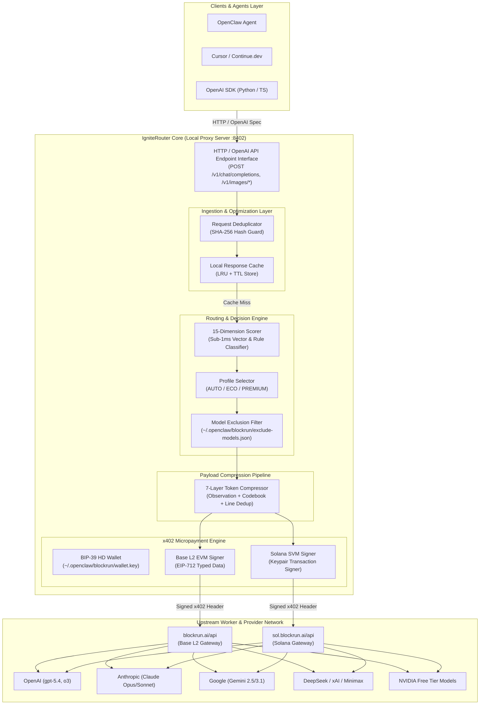

# IgniteRouter Architectural Design Document

This document provides a comprehensive technical breakdown of **IgniteRouter** — an open-source, local, agent-native smart LLM router designed to reduce AI API costs by up to 92% through intelligent model selection, local caching, token compression, and non-custodial x402 micropayments.

---

## 🏛️ Executive Architectural Diagram

---

## ⚡ Core Subsystem Breakdown

### 1. Ingestion & Optimization Layer
- **Request Deduplicator (`src/dedup.ts`)**: Computes SHA-256 hashes of incoming prompt payloads. If an identical request is in-flight or completed within a 30s window, the proxy deduplicates the call to prevent double-charging during agent retry storms.
- **Local Response Cache (`src/response-cache.ts`)**: In-memory LRU cache storing responses for frequent queries. Cache hits resolve immediately in 0ms with zero network traffic or cost.

### 2. Decision & Routing Engine
- **15-Dimension Scorer (`src/models.ts`, `src/router/`)**: Evaluates token count, code ratio, multi-file markers, mathematical symbols, and prompt complexity in sub-1ms.
- **Tier Classification**:
  - `SIMPLE`: Routed to free models or ultra-fast flash tiers (e.g. Gemini Flash, GPT-OSS).
  - `MEDIUM`: Routine code edits and summaries (e.g. DeepSeek Chat, Kimi).
  - `COMPLEX`: Multi-file refactoring and complex logic (e.g. Gemini 3.1 Pro, Claude Opus).
  - `REASONING`: Mathematical proofs and heavy logic (e.g. o3, Grok Reasoning, Claude Sonnet).

### 3. Payload Compression Pipeline (`src/compression/`)
- Compresses conversation context, terminal logs, and system prompt headers before sending data to upstream APIs. Saves up to 97% on observation input tokens.

### 4. Cryptographic x402 Micropayment Engine (`src/auth.ts`, `src/x402-sdk.ts`)
- Client-side payment authorization compliant with [x402 protocol](https://x402.org).
- Dual-chain support:
  - **Base L2 (EVM)**: Signs EIP-712 structured typed messages.
  - **Solana (SVM)**: Signs SVM transaction headers.
- **Security Guarantee**: Private keys remain stored locally at `~/.openclaw/blockrun/wallet.key` and are never transmitted across the network.

---

## 📂 Vendors & External Integrations

Third-party reference architectures and vendor integrations are organized inside the `vendors/` directory:

- [`vendors/OmniRoute`](file:///d:/Recks/IgniteRouter/vendors/OmniRoute) — Multi-provider fallback routing integration reference.
